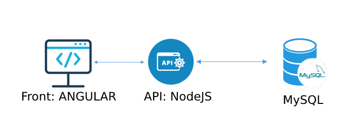

# Código del proyecto de CIDENET - Talento Humano

Es un modulo WEB para realizar el registro y control de empleados.

Este módulo está codificado con las siguientes tecnologías: Angular, Express, NodeJS, MySQL.

El código contiene 2 proyectos: [api](./api), [front](./front).

## Diagrama de la solución



## Version

1.0.0

## Clonar el proyecto

```
git clone https://github.com/iAgrinet/marketplace.git
```

## Instalación e inicio del backend(NodeJS)

### API

Este proyecto se utiliza para interactuar con la base de datos.

Para mas información [clic aquí](./api/README.md)

1. Instalar la API

    ```
    cd api
    npm install
    ```

2. Configurar las variables de entorno en el archivo .env

    Ejemplo:

    ```
    PORT = <puerto>
    ```

3. Iniciar la API

    ```
    npm start
    ```


## Instalación e inicio del frontend(Angular)

Este proyecto se utiliza para crear la interfaz grafica y desde aquí se hacen las conexiones al backend(api y a la api_cms).

Para mas información sobre este proyecto [clic aquí](./front/README.md)

Para iniciar el funcionamiento del proyecto front, hacemos lo siguiente:

1.  Instalar paquetes

    ```
    cd front
    npm install
    ```

2.  Configurar las variables de entorno del frontend

    2.1. Ir a la carpeta environments

    ```
    cd front/src/environments
    ```

    2.2. Configurar las variables de entorno en desarrollo, en el archivo environment.ts

        Ejemplo:

        ```
        {
			production: false,

			API: 'http://<ip servidor api>:<puerto>',
        }
        ```

3.  Compilar y correr el frontend.

    En desarrollo

    ```
    ng serve o npm start
    ```

    En Producción

    ```
    ng build
    ```
